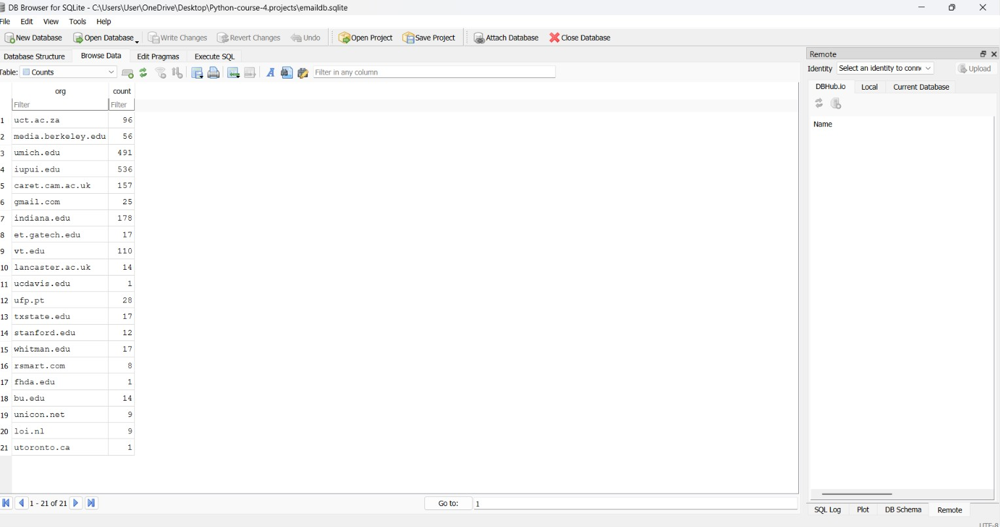
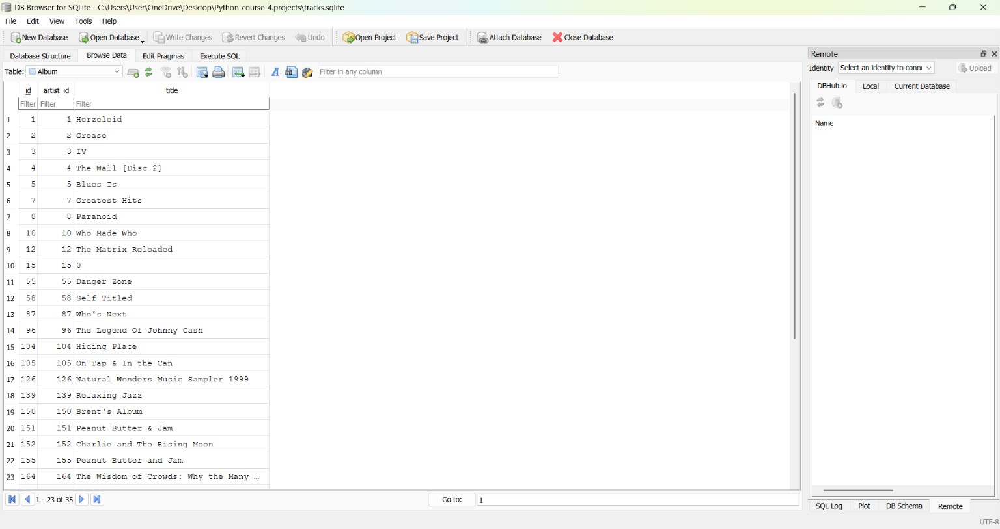

# Python for Everybody - Course 4: Using Databases with Python

This repository is a portfolio of my work for the "Using Databases with Python" course, part of the *Python for Everybody* specialization on Coursera.

## About the Course
In this course, I developed practical skills in:
- **Object-Oriented Programming (OOP)**: Designing classes, inheritance, and methods.
- **Relational Databases (SQLite)**: Designing database schemas, executing SQL queries (SELECT, INSERT, UPDATE), and managing many-to-many relationships.

## Project Files
*   `oop_basics.py`: Implementation of class structures and inheritance concepts.
*   `email_tracker.py`: Parsing text files to track organization domain frequencies in an SQLite database.
*   `music_library.py`: Importing CSV data into linked tables (Artist, Genre, Album, Track) using foreign keys.

## Database Results
### Email Tracker Data

### Music Library Schema

## Certificate
[View My Course Completion Certificate](https://www.coursera.org/account/accomplishments/certificate/ITDLSAC7J16L)

---
*Developed by Sevinc Zaur Qasimova*
